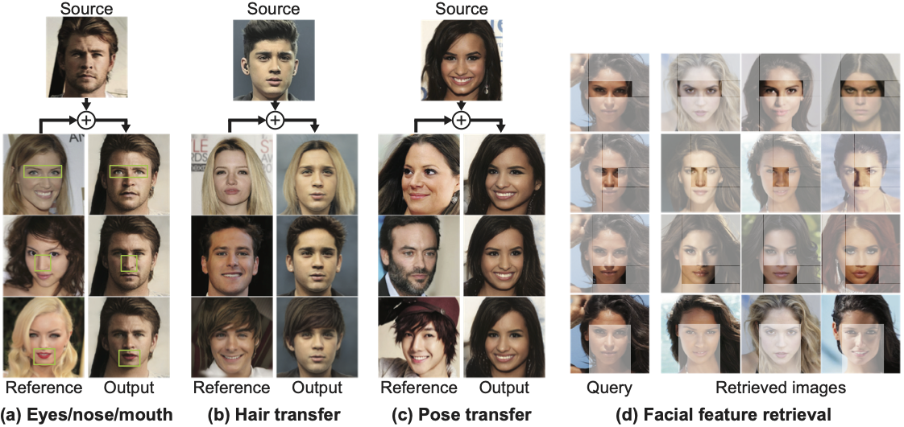

# Retrieve in Style: Unsupervised Facial Feature Transfer and Retrieval PyTorch


This is the PyTorch implementation of [Retrieve in Style: Unsupervised Facial Feature Transfer and Retrieval](). [](https://colab.research.google.com/github/mchong6/RetrieveInStyle/blob/main/RIS_colab.ipynb)


>**Abstract:**<br>
>We present Retrieve in Style (RIS), an unsupervised framework for fine-grained facial feature transfer and retrieval on real images Recent work shows that it is possible to learn a catalog that allows local semantic transfers of facial features on generated images by capitalizing on the disentanglement property of the StyleGAN latent space. RIS improves existing art on: 
>1) feature disentanglement and allows for challenging transfers (\ie, hair and pose) that were not shown possible in SoTA methods.
>2) eliminating the needs for per-image hyperparameter tuning, and for computing a catalog over a large batch of images.
>3) enabling face retrieval using the proposed facial features (\eg, eyes), and to our best knowledge, is the first work to retrieve face images at the fine-grained level.
>4) robustness and natural application to real images. 
>Our qualitative and quantitative analyses show RIS achieves both high-fidelity feature transfers and accurate fine-grained retrievals on real images. 
>We discuss the responsible application of RIS.

## Dependency
Our codebase is based off [stylegan2 by rosalinity](https://github.com/rosinality/stylegan2-pytorch). 
```bash
conda install --yes -c pytorch pytorch=1.7.1 torchvision cudatoolkit=<CUDA_VERSION>
pip install tqdm gdown scikit-learn scipy lpips dlib opencv-python
```

## How to use
Everything to get started is in the [colab notebook](https://colab.research.google.com/github/mchong6/RetrieveInStyle/blob/main/RIS_colab.ipynb).

## GAN inversion
There are 2 ways to apply RIS to real images. We provide a code to perform GAN inversion on real images using gradient descent. This snippet is adapted from [Improving Inversion and Generation Diversity in StyleGAN using a Gaussianized Latent Space](https://arxiv.org/abs/2009.06529). To run it, inversion_stats.npz which is needed will be downloaded automatically or manually from [here](https://drive.google.com/drive/folders/1OvXPzT4SqJcZWWjsRNyU2m35AaMP6eq0?usp=sharing). Alternatively you can generate it yourself by following the instructions in the notebook.

For large scale real image inversion for retrieval, an encoder-based GAN inversion is needed. In our paper we use [pixel2pixel2style](https://github.com/eladrich/pixel2style2pixel) but others like [encoder4editing](https://github.com/omertov/encoder4editing) should work too. Note that most inversion methods give you a code in the W+ space. However, RIS works in style space. To convert from W+ to style space, 

```python
w_plus =  pickle.load(open("file.pkl", "rb")).cuda() # this should have shape of [b, 18, 512]
latent = generator.get_latent(w_plus, truncation=1, is_latent=True) # convert to style space.
latent = style2list(latent) # the generator expects a list format
im, _ = generator(latent)
```
This step is not needed if you use our projection code.

## Citation
If you use this code or ideas from our paper, please cite our paper:
```
```

## Acknowledgments
This code borrows heavily from [StyleGAN2 by rosalinity](https://github.com/rosinality/stylegan2-pytorch), [Editing in Style](https://github.com/IVRL/GANLocalEditing) and partly from [StyleClip](https://github.com/orpatashnik/StyleCLIP) and [PTI](https://github.com/danielroich/PTI).
